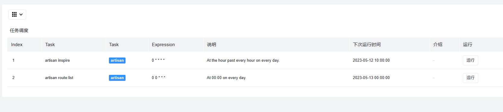

# BizAdmin Scheduling Extension
 **一个显示 laravel 任务调度的包**

> 修改 laravel admin 的 scheduling 扩展，使其支持bizadmin
> https://github.com/laravel-admin-extensions/scheduling


## Installation
```bash
composer require dagasmart/scheduling
```


Try to add a scheduling task in **app/Console/Kernel.php** like this:

```php 

class Kernel extends ConsoleKernel
{
    protected function schedule(Schedule $schedule)
    {
        $schedule->command('inspire')->everyTenMinutes();

        $schedule->command('route:list')->dailyAt('02:00');
    }
}
```

